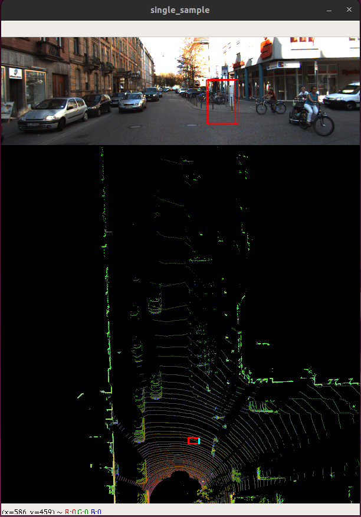

# readme

## deps setup

- create the env
I've created a python3.8 venv then installed the [requirements](../requirements.txt)

??? note "`requirements.txt`"

    ```plaintext
    torch==1.5.0
    torchvision==0.6.0
    easydict==1.9
    opencv-python==4.2.0.34
    numpy==1.22.0
    torchsummary==1.5.1
    tensorboard==2.2.1
    scikit-learn==0.22.2
    ```

??? note "installation"
    - setup env

        ```bash
        conda activate base38
        python -m venv venv
        source .venv/bin/activate
        pip install uv
        ```

    - install requirements

        ```bash
        uv pip install -r requirements.txt
        ```

    - install [shapely](https://shapely.readthedocs.io/en/stable/installation.html) and [mayavi](https://docs.enthought.com/mayavi/mayavi/installation.html) as mentioned in the readme

        ```bash
        uv pip install mayavi pyQt5 shapely
        ```
    - freeze the deps

        ```bash
        uv pip freeze > ./docs/requirements-full.txt
        ```

## a first setup

Here, i need kitti dataset to see if the visu is working with their software

- download the kitti dataset
I've added a code ([run_kitti_data_prep](../run_kitti_data_prep.sh)) to download it. But, for now, i did use a sample from another project.

- run the test script

    ```bash
    cd src/data_process
    python kitti_dataloader.py --output-width 608
    ```

That will show a visualization with different frames as i clisk on `n` from the keyboard



## inference !

i download the pretrained [here](https://drive.google.com/drive/folders/1RHD9PBvk-9SjbKwoi_Q1kl9-UGFo2Pth) and put it in 